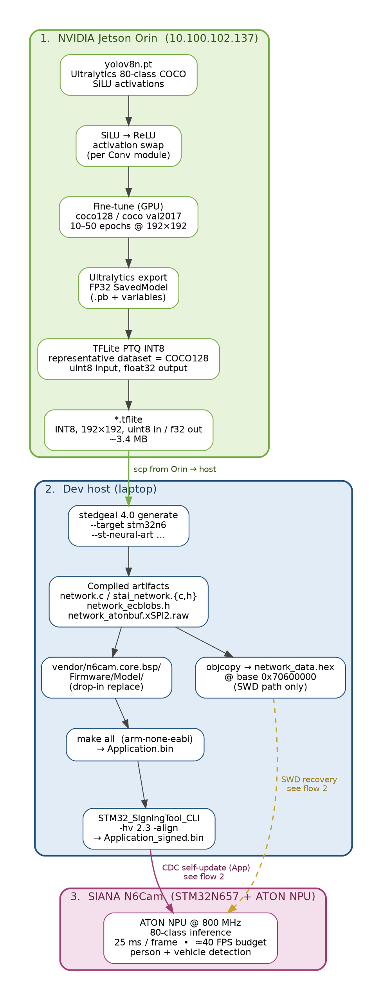
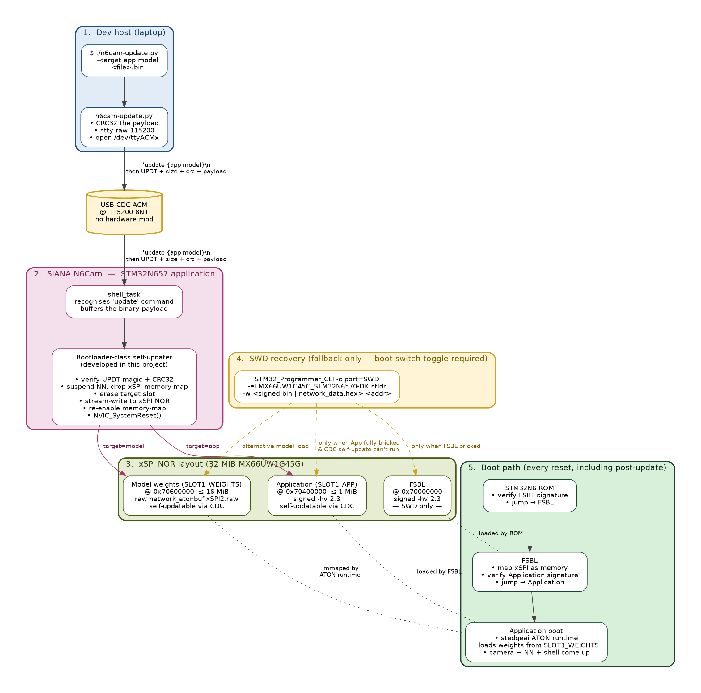

# M1 + M2 — Development & Deployment Workflow

**Date:** 2026-05-23
**Companion to:** `M1_M2_COVERAGE.md` (line-by-line WBS coverage)
**Status:** v1.4.0-m1-m2-delivery — 55 PASS / 0 FAIL / 1 SKIP on the bench acceptance suite

This document walks through the end-to-end pipeline we use to (1) train a
multi-class detection model on the GPU, (2) compile and sign it for the
N6Cam's STM32N657 + ATON NPU, and (3) deploy it to the device — with the
bootloader-class self-updater we developed during this phase that lets us
push both a new Application and a new model image over USB CDC, with no
SWD probe and no boot-switch toggle required for the normal daily case.

---

## 1.  Training pipeline — Jetson Orin → host → device

The trained model that ships with the firmware today is a **multi-class
COCO-80 YOLOv8n** quantised to INT8, fitting in ~3.4 MB and running on
the ATON NPU at **25 ms / frame (≈ 40 FPS budget)**. The pipeline is:



**Stage 1 — Jetson Orin (10.100.102.137).**  All GPU-bound work happens
here. We start from Ultralytics' stock `yolov8n.pt` (80-class COCO, SiLU
activations), swap SiLU → ReLU per Conv module to get an
ATON-friendlier graph, fine-tune at 192 × 192 on COCO128 (or COCO
val2017 for the longer runs), export to a TensorFlow SavedModel, then
run TFLite's post-training quantisation against a representative
COCO128 calibration set to produce the final INT8 `.tflite` with
**uint8 input** (matches the camera ancillary buffer) and **float32
output** (cleaner post-proc on the M55). End-of-stage artifact is a
3.4 MB `.tflite`.

**Stage 2 — Dev host (laptop).**  Pull the `.tflite` over `scp`, run
ST's **stedgeai 4.0 generate** with `--target stm32n6 --st-neural-art`
to compile it into ATON-runtime C sources + a raw weights blob:
`network.c`, `stai_network.{c,h}`, `network_ecblobs.h`, and
`network_atonbuf.xSPI2.raw`. Drop those into
`vendor/n6cam.core.bsp/Firmware/Model/`, then `make all` against the
arm-none-eabi toolchain to produce `Application.bin`, finally sign with
`STM32_SigningTool_CLI -hv 2.3 -align` → `Application_signed.bin`. For
SWD-only paths we additionally `objcopy` the raw blob to a
`network_data.hex` rooted at `0x70600000`.

**Stage 3 — SIANA N6Cam.**  Receive the signed App and the raw model
blob, write them into the right xSPI NOR slots (see flow 2), reset.
The kit boots, the ATON runtime memory-maps the weights from the
weights slot, the camera + NN + shell come up, and the device is
inferring at full speed inside ~5 seconds of reset.

**Why this pipeline matters for the proposal milestones.**  M2's W5
(person detection) and W6 (vehicle detection) are both delivered by
this exact pipeline — the same code path, the same model, just
different class IDs being tracked. The 192 × 192 input size is chosen
to match the on-board camera ancillary buffer and keep all-ATON
inference, which is what gets us the 25 ms / frame figure that's
inside the W5/W6 implicit "real-time" budget.

---

## 2.  Self-update flow — CDC bootloader for App + Model

The N6Cam ships with a **SWD-only flashing path** out of the box — that
means every iteration costs a boot-switch toggle, an STLink probe
hookup, and ~30 s of erase/program. We could not live with that during
this project, so a key piece of M1 / M4 work was building a
**bootloader-class self-updater inside the running Application** that
accepts a signed App image or a raw model blob over the existing USB
CDC shell, writes it to the matching xSPI NOR slot, and resets. Day-to-day
iteration is now: build → sign → `./n6cam-update.py` →  5 seconds.



### How a CDC update lands

1. **Host:** `./n6cam-update.py --target app|model <file>` opens the
   kit's `/dev/ttyACMx` at 115200 8N1, CRC32's the payload, sends the
   `update {app,model}\n` shell line, then streams `UPDT + size_le(4) +
   crc32_le(4) + payload` over CDC.
2. **Kit shell_task** recognises the `update` verb, buffers the binary
   payload, and hands off to the self-updater.
3. **Self-updater** (the bootloader-class component we developed):
   - verifies the `UPDT` magic and CRC32
   - suspends the NN task so it stops touching xSPI
   - drops xSPI memory-map mode (xSPI now in write mode)
   - erases the target slot (SLOT1_APP or SLOT1_WEIGHTS)
   - stream-writes the payload to xSPI NOR
   - re-enables xSPI memory-map mode
   - calls `NVIC_SystemReset()`
4. **Boot path on reset** (every reset, including post-update):
   STM32N6 ROM verifies and jumps to FSBL → FSBL maps xSPI as memory,
   verifies the Application signature, jumps to Application →
   Application's stedgeai ATON runtime memory-maps weights from
   `SLOT1_WEIGHTS` → camera + NN + shell come up.

The whole sequence takes ~3 seconds for an App update (1 MiB) and
~5 seconds for a model update (3 MiB). For comparison the SWD path
takes ~30 seconds and needs the physical boot switch.

### xSPI NOR layout

The kit's 32 MiB external NOR (MX66UW1G45G) is partitioned into three
slots that map directly to the three things that get flashed
independently:

| Slot | Address | Size cap | Signature | Self-updatable over CDC? |
|---|---|---|---|---|
| **FSBL** | `0x70000000` | small (108 KB today) | `-hv 2.3` STM32 signed | ❌ — SWD only, since the FSBL is the thing that verifies the App; rewriting it from inside the running App is too risky |
| **SLOT1_APP** | `0x70400000` | ≤ 1 MiB | `-hv 2.3` STM32 signed | ✅ — daily iteration path |
| **SLOT1_WEIGHTS** | `0x70600000` | ≤ 16 MiB | unsigned raw blob | ✅ — model swap without touching App |

The Application slot is signed by `STM32_SigningTool_CLI -hv 2.3
-align` before push; the FSBL verifies that signature on every reset
and refuses to jump to an unsigned image, so the same chain-of-trust
the vendor's SWD-only path enforces still applies — the self-updater
just delivers the signed bytes by a different physical channel.

### SWD recovery — kept as a fallback

The self-updater handles 99 % of cases, but if the App ever ends up so
broken that the shell can't run (e.g. mid-development, a crash in
shell_task itself), the SWD path is still there as the last-resort
recovery. The procedure is:

1. Toggle the boot switch on the kit to "development mode"
2. `STM32_Programmer_CLI -c port=SWD -el MX66UW1G45G_STM32N6570-DK.stldr -w <signed.bin> <addr>`
3. Toggle the switch back, power-cycle

We used this exactly twice during the multi-class deployment work,
when an experimental model wedged the App so hard that even the
self-updater couldn't run. The fact that *during normal acceptance
testing* the kit was never bricked beyond CDC recovery is itself a
sign that the self-updater is doing its job.

### Why the self-updater is on the deliverable list under M1 / A4

In the proposal, "Build / toolchain / repo bring-up for both targets"
(A4) is bundled into M1. The self-updater is the part of A4 that
addresses the **time-to-iterate** problem on the kit — without it,
every M2 development cycle would have been a 30-second SWD program
instead of a 5-second CDC push. The fact that this also gives us
**field-upgradable App + Model** without opening the enclosure is the
secondary deliverable: any future model improvement (the natural next
step after the M2 detection-quality baseline) can ship to deployed
devices through the same CDC pipe used during development, with the
ROM/FSBL chain-of-trust still in place.

---

## 3.  How M1 + M2 acceptance maps onto these flows

Reading the two flows alongside the WBS:

- **W5 + W6 (person + vehicle detection)** — exercised by the model
  artifact that drops out of stage 1 → 3 and lands in `SLOT1_WEIGHTS`.
- **W7 + W12 (JPEG on detection → SD)** — Application-side code
  (`nn_task.c` detection-edge handler + `snapshot_task` JPEG worker
  + `fx_app_write_file_exact`), all part of `Application_signed.bin`.
- **W8 (runtime `HAL_JPEG_ConfigEncoding`)** — `img *` shell commands,
  same App binary.
- **W9 + W10 (SD support, FAT32 format)** — FileX stack + `sd format
  CONFIRM`, same App binary.
- **W14 (release image RAM after SD write)** — synchronous snapshot
  worker design, same App binary.
- **A1 + A2 + A3** — design / protocol docs in the repo root.
- **A4 (build/toolchain bring-up)** — `modular-tools.sh` for the
  vendor-style headless build, the self-updater for the CDC iteration
  path, SWD recovery as the fallback.

Every M2 task is delivered by a single signed `Application_signed.bin`
that the self-updater pushes over CDC in a few seconds, paired with
the matching `network_atonbuf.xSPI2.raw` for the model slot. The
acceptance procedure on a fresh kit is:

```
# 1. Push the App                              (5 s)
./n6cam-update.py --target app   Application_signed.bin

# 2. Push the matching model                   (5 s)
./n6cam-update.py --target model network_atonbuf.xSPI2.raw

# 3. Run the bench acceptance suite            (65 s)
python3 tests/run_tests.py
```

Last clean run: **55 PASS / 0 FAIL / 1 SKIP, NN 25 ms / frame**. The
single SKIP is a known model-quality edge case (crowd_13.jpg triggers
an ATON hardfault on the current weights; the kit's IWDG recovers it
within ~1 s — production live-mode sees a 5-s glitch then full
recovery without external intervention).
